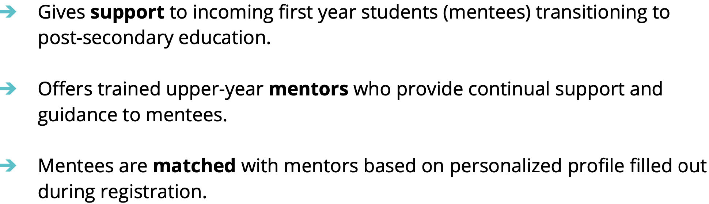
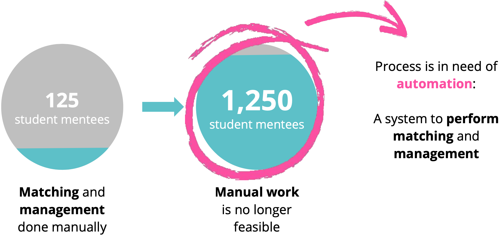
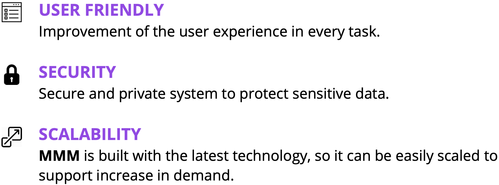
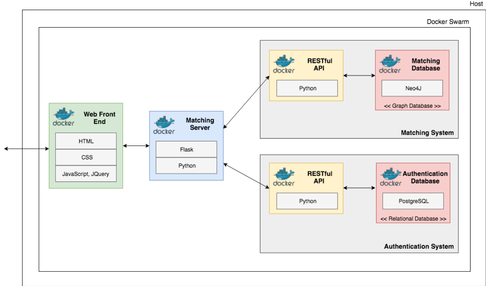
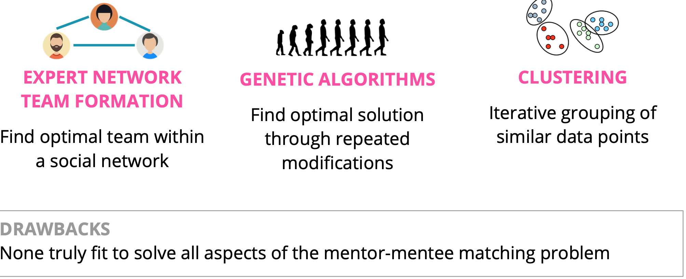
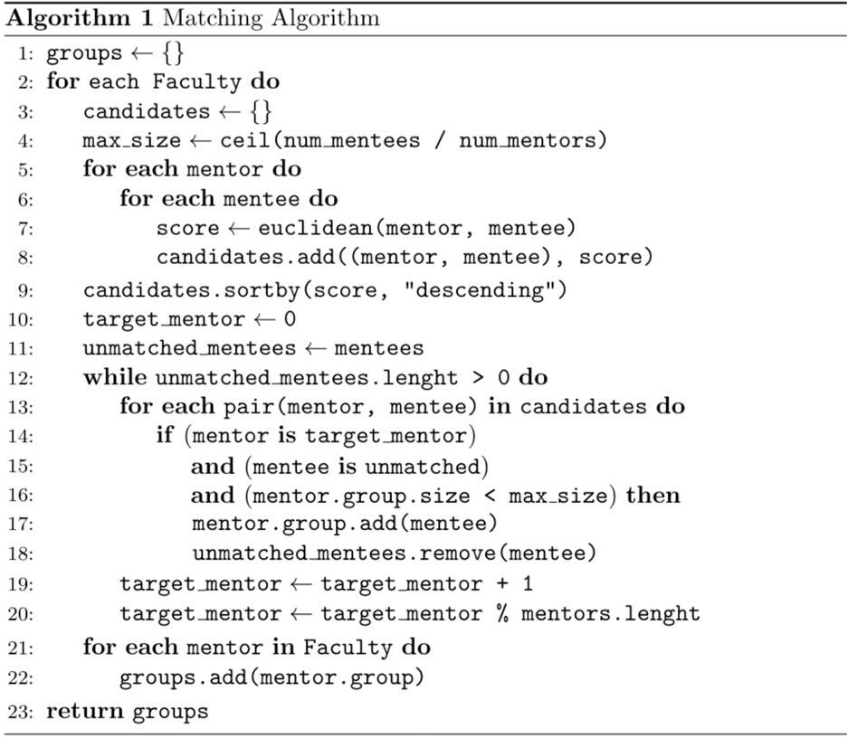
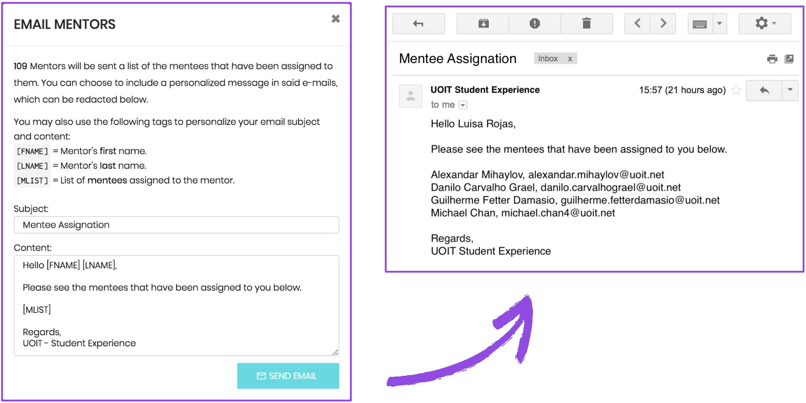
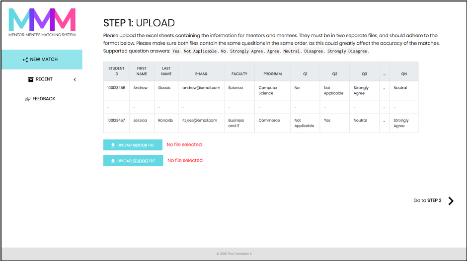
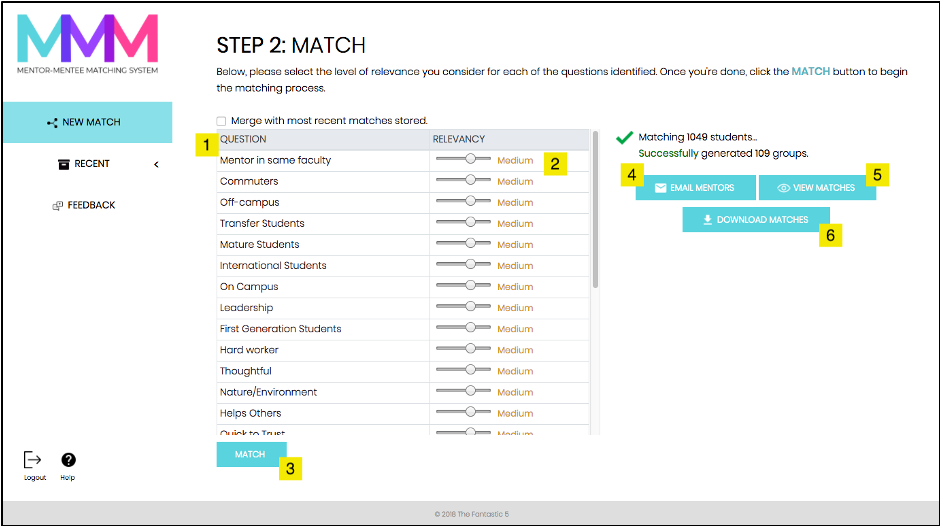
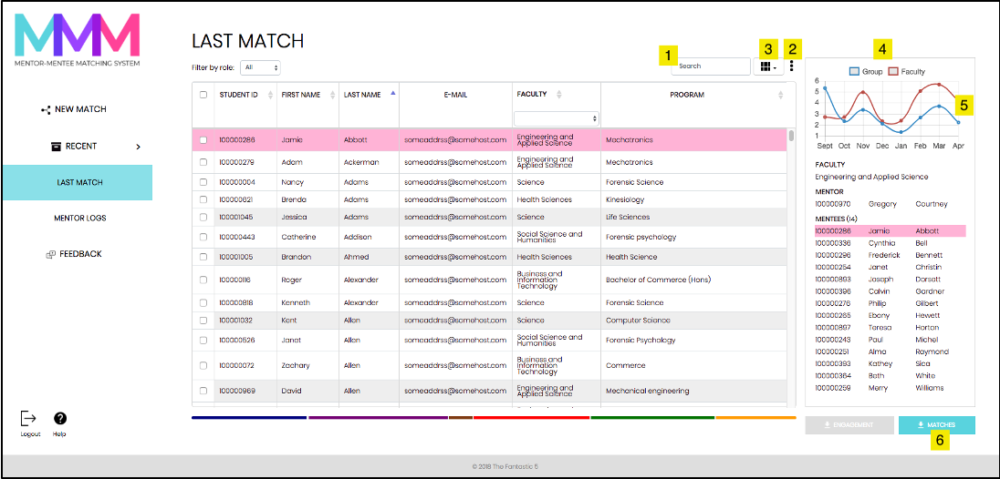

 

<a href="#background-and-motivation">Background && Motivation</a>
&nbsp; • &nbsp;
<a href="#overview">Overview</a>
&nbsp; • &nbsp;
<a href="#algorithm">Algorithm</a>
&nbsp; • &nbsp;
<a href="#features">Features</a>
&nbsp; • &nbsp;
<a href="#ui">User Interface</a>

  

# Background && Motivation

## Background
### Ontario Tech Student Mentorship Program

## Motivation

 

# Overview

✅ Automated group generation per faculty through the matching of mentors and mentees. 
&emsp;&emsp; 👉🏼 Excel file upload and download. 
&emsp;&emsp; 👉🏼 Ability to merge batches of students entered. 
&emsp;&emsp; 👉🏼 Custom question weighting. 
&emsp;&emsp; 👉🏼 Manual mentor and mentee assignation. 

✅ Mentor log management and mentee feedback for program assessment. 
&emsp;&emsp; 👉🏼 Form builder and response manager.

✅ Track the continued engagement of mentees and mentors. 
&emsp;&emsp; 👉🏼 Download of tracked engagement data summary. 
&emsp;&emsp; 👉🏼 Visualization of engagement per group.  

## Tools && Architecture

 

# Algorithm

We looked into different current algorithms that could be a good fit for our problem. However, we found significant drawbacks for those that we found, so we opted for designing our own:

✅ Based on K-Means clustering algorithm 
✅ Customizable number of mentees per group 
✅ Guarantees one mentor per group 

  

 

# Features

## Matching

## Data Management
  

## Utility

## Analytics

 

# User Interface

  

  

  

  

  